

  

Chaindraft
---

A blockchain-based NFL draft consumer app using random player draws, user-determined skips, and smart contract stored fantasy contest pages.

Generate your dream lineup for online contests using the app with lineups tracked on smart contracts. Keep your lineup as a shareable url with an at-submission attestation proving you drafted a given roster and at what time. Challenge other players in contests that are either free to play or with fee for entry.

* Chiliz for L1 deployment (public voting and trending players)
* Fhenix for L2 deployment (private voting and security)
* Morph for L2 deployment (settlement and speed)

Try out the demo here: https://chaindraft.vercel.app/

Demo video:

Built for EthGlobal Online 2024

### Inspiration

Pain points:

- Traditional fantasy football platforms are centralized, and often require large engineering teams to run. Chaindraft is a completely smart-contract driven solution with lineups and verdicts saved as entries on each network-specific contract.
- There is often limited flexibility and customization in league settings and rules.
- Transaction fees and high KYC can cause frustration, especially when dealing with withdraws and rewards. Example: many platforms require entering your SSN just to cash out! Platforms like FanDuel taking 10% of every paid contest.
- Managing league data securely and transparently is a challenge with existing solutions.

### How Blockchain is Used

- **Blockchain provides a transparent and immutable ledger** for tracking league activities, transactions, and player statistics.  Additionally, each interaction with the contract is emitted as a smart contract event which can be listened to on external platforms or apps.
- **Smart contracts automate league management** tasks, such as scoring, payouts, and rule enforcement, ensuring fairness and consistency.
- **Identity verification** ensures that only verified users can participate, preventing fraud and multi-accounting. Each lineup submission requires a valid attestation in order to be recorded as a valid contest entry.

### Technologies Used

- **Web3Auth**: Provides a user-friendly interface for users to connect their wallets to the Chaindraft application. Each chain config is embedded and selectable in the app, and authentication state is saved/preserved upon refresh. Providers from each wallet are used to execute transactions for each contest smart contract entry. Used as the primary form of login and access control for the ChainDraft app across Chiliz, Fhenix, and Morph cross chain contract interactions.
- **Sign Protocol**: Ensures the human verifiable claim that the roster was produced randomly. A schema entry and attestation is created for each player draft as proof / evidence of non-tampering between submission and time of contest evaluation. Going after the sign everything, schema, and consumer engagement/business apps categories.
- **Chiliz**: A blockchain-based fintech platform that allows fans to buy, trade, and execute voting rights in their favorite sports teams. In the context of BlockFantasy, Chaindraft is a SportFI project which could leverage Chiliz network for fan engagement and rewards, offering unique experiences and merchandise. The demo site below is live and contracts can be deployed and interacted with on the Spicy testnet.

Link to master contract (testnet): https://testnet.chiliscan.com/address/0x75cFA6a80531a005E7a2144318cED954CDA10113
Example contest on Chiliz network: https://chaindraft.vercel.app/contest/1

- **Fhenix**: L2 chain used to provide additional security and a lower cost option for submission and contract interactions for each contest. Payouts and withdraws from contests. A master contract is deployed on Fhenix that manages all the contest creations, lineup submissions, and contest state management (created, cancelled, started, won, etc.) at low cost. Can see some example transactions on the contract below.

Link to master contract (testnet): https://explorer.helium.fhenix.zone/address/0x6C97D08dc8F0b911A171AbdF9612CB78135197b6
Example contest on Fhenix network: https://chaindraft.vercel.app/contest/1

- **Morph**: L2 chain used to provide additional security and a lower cost option for submission and contract interactions for each contest. Payouts and withdraws from contests. A master contract is deployed on Morph that manages all the contest creations, lineup submissions, and contest state management (created, cancelled, started, won, etc.) at low cost. Can see some example transactions on the contract below. Going after the consumer centric track category with a simple UI and use case.

Link to master Morph contract (testnet): https://explorer-holesky.morphl2.io/address/0x973Ec243E24Bf62b56b0F338dd2704371DD5B2db
Example contest on Morph network: https://chaindraft.vercel.app/contest/1

- **XMTP (Extensible Message Transport Protocol)**: Enables secure, decentralized messaging within the app. After a contest starts and XMTP Chat becomes available on the contest page for users to discuss live - including the outcome. A unique chat is automatically created for each contest. Players are able to message and chat with other players after each contest has started from the contest page and have them tracked as conversations on the main messaging page of the app below. XMTP-js in particular is used as the infrastructure layer for this with creating conversations, messages, and querying conversation lists by address.

Main messaging page (tracks received messages): https://chaindraft.vercel.app/messages

### Challenges

- Integrating multiple blockchain service providers into a single cohesive application.
- Ensuring a smooth user experience while interacting with blockchain features like smart contracts and digital wallets.
- Balancing decentralization with the need for quick and responsive user interactions.

### Potential Future Work

- **Expanding cross-chain capabilities** to support more blockchains, offering users a broader range of options for transactions and participation including contests across multiple networks at the same time.
- **Integrating with NFT marketplaces** to allow users to buy, sell, and trade fantasy draft-related NFTs. Create an NFT either showcasing your particular random draft or a contest win.
- **Payment and user model**: Support tracking user performance in contests over time and controlled payouts and incentives for participating in more contests with friends.
- **Automated verdicts**: NFL does have some lockdown on APIs for fetching conclusions and lineups. Production deployment should use official APIs and authentication keys for doing more automated contest verdicts.

### Screenshots

## Screenshots

### Home
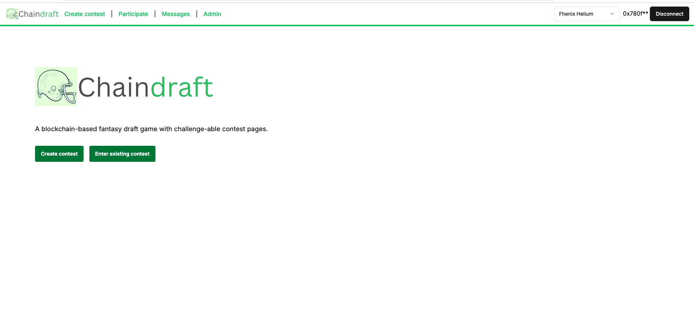

### Chiliz Contract
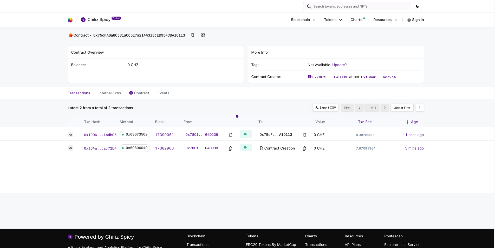

### Chiliz Create
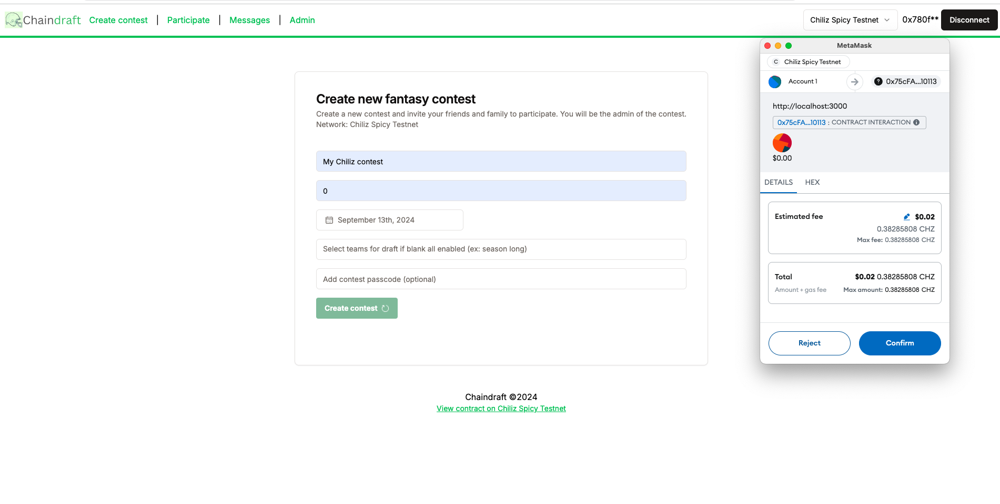

### Morph Deploy
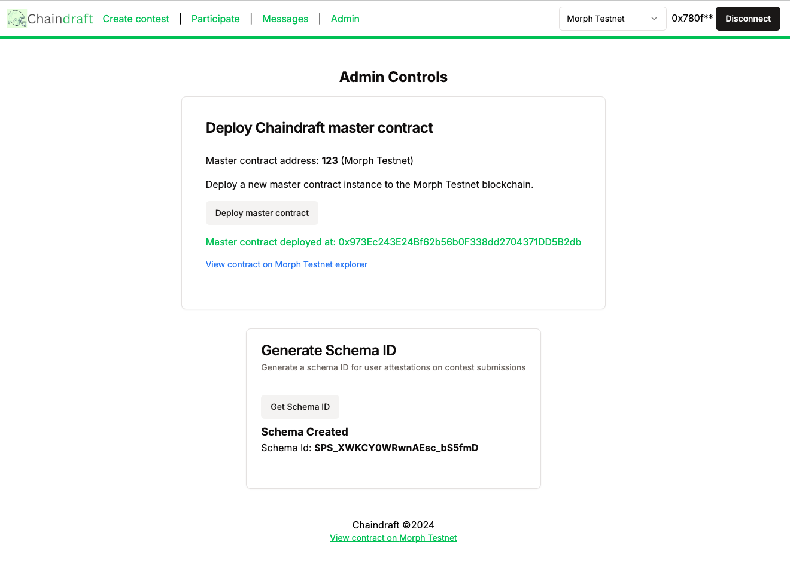

### Fhenix Contract
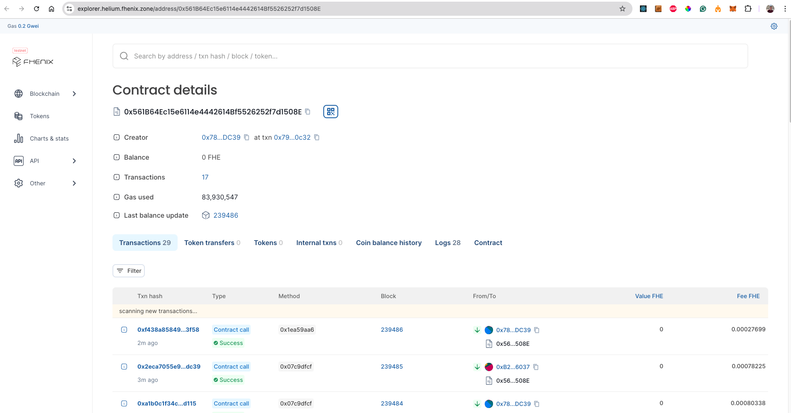

### Create New Contest
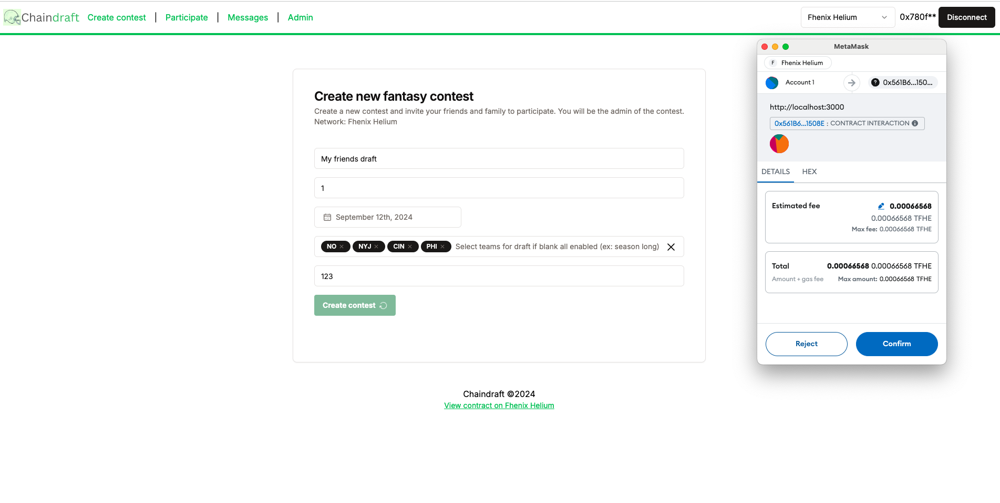

### Contest Receipt
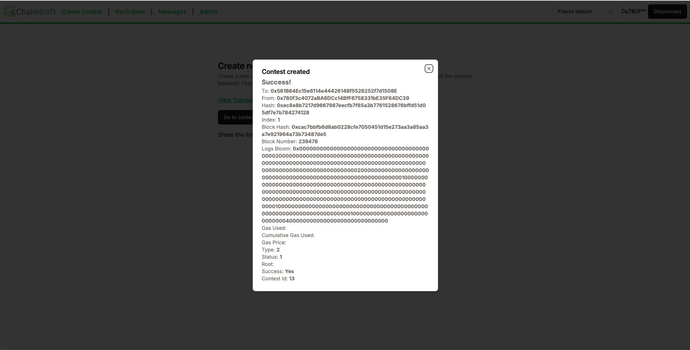

### Contest Created
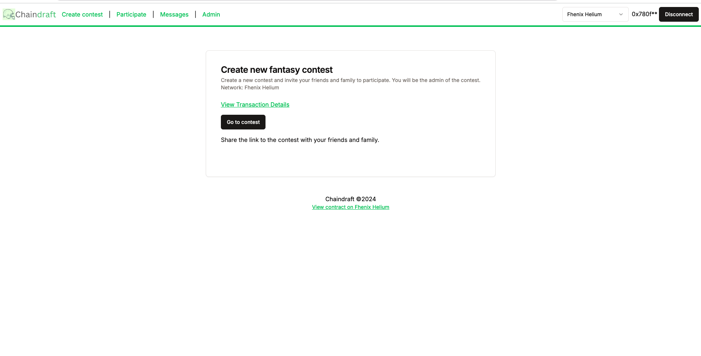

### Drafting a new lineup
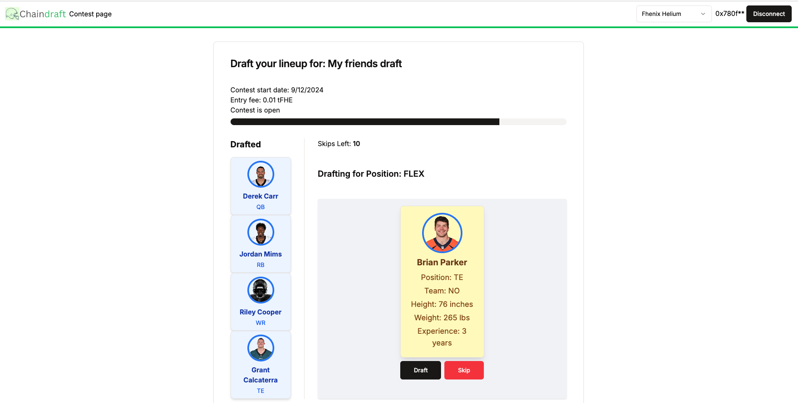

### Submit Lineup
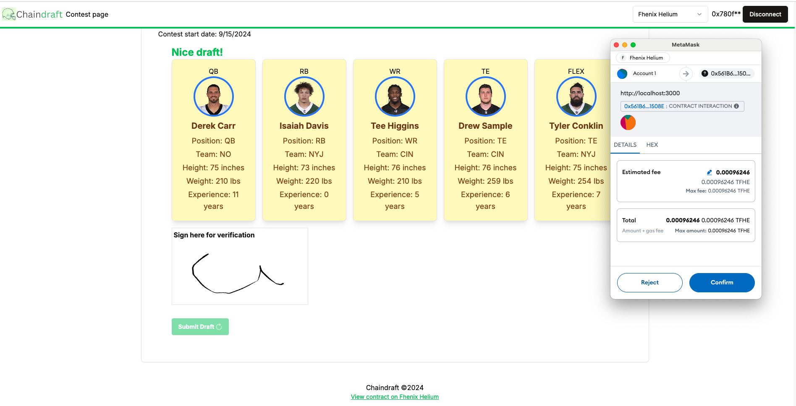

### Every lineup submission generates a signature and saved attestation
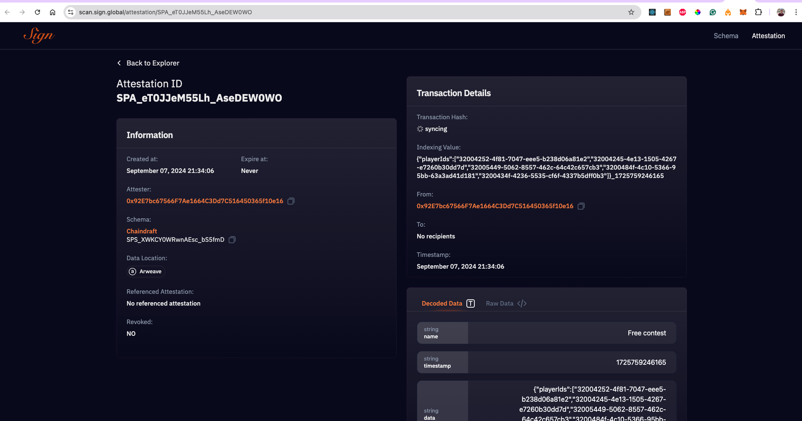

### Submissions closed (waiting for verdict)
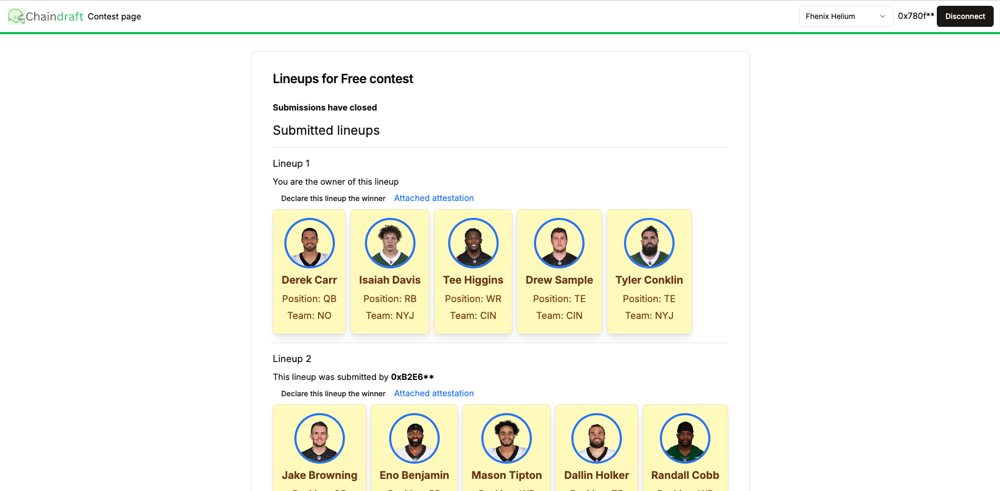

### Set Winner
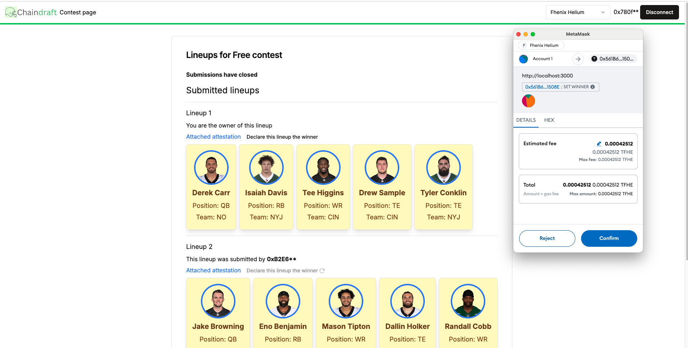

### Winner
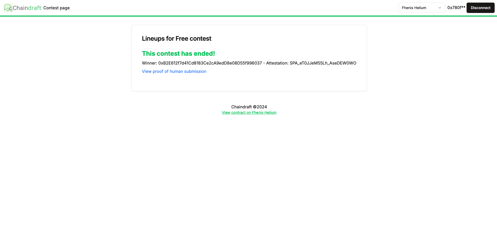

### XMTP Conversations initiated from other contest players
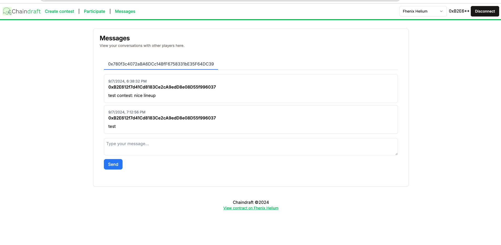

### XMTP Sent messages
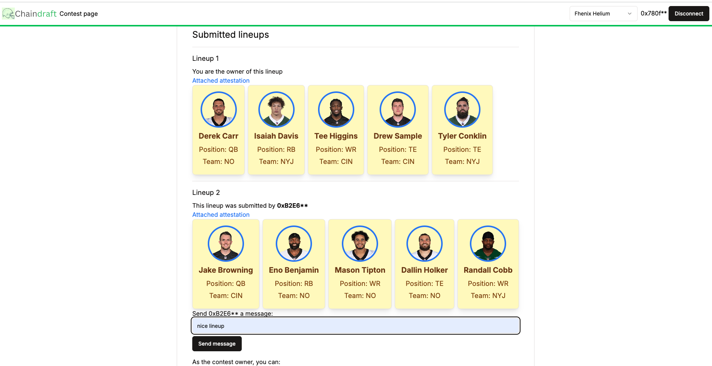

### Contract Events
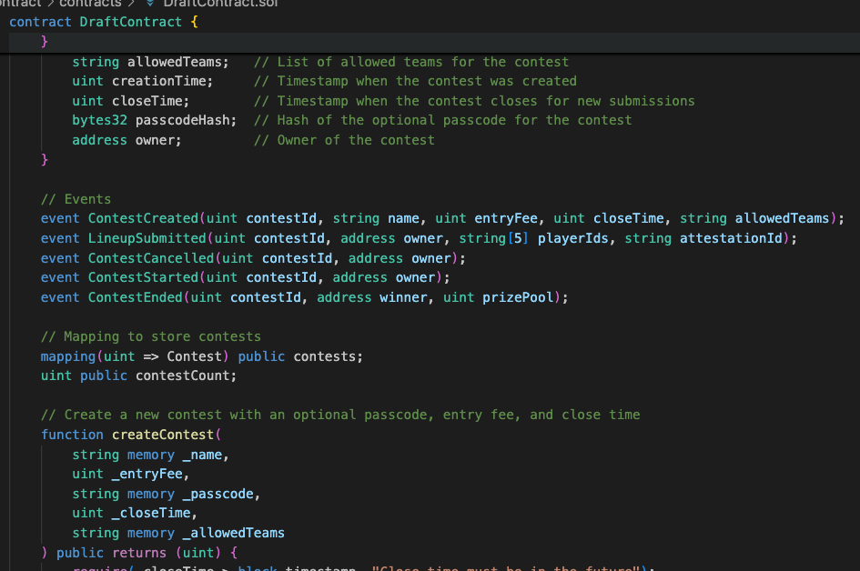

### Useful links
* https://github.com/nflverse/nflverse-data/releases/tag/players
* https://github.com/Web3Auth/web3auth-web
